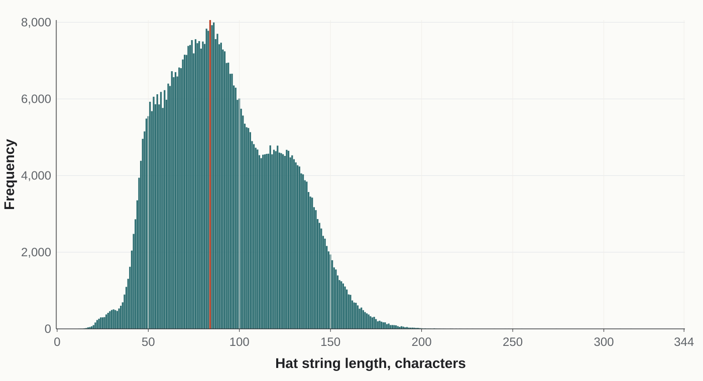
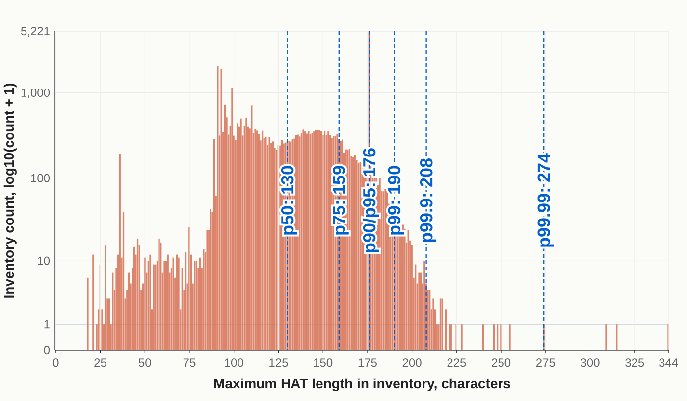

# Hat Length Frequency Charts

Generated from `data/inv.db`, grouped by `length(hat)`.

[Distinct hats CSV](distinct_hat_length_frequency.csv) | [Inventory max CSV](inventory_max_hat_length_frequency.csv) | [Log SVG](hat_length_frequency_log_compare.svg)

## Distinct Hats

Frequency of HAT string lengths across unique HAT strings in `inv.db`.

[Open SVG](distinct_hat_length_frequency.svg)

| Metric | Value |
| --- | ---: |
| Unique Hats | 626,859 |
| Length Range | 12-344 |
| Peak Frequency | 8,058 |
| Peak | 84 chars |

| Percentile | Length | Sample distinct HAT |
| --- | ---: | --- |
| p50 | 88 | `Airborne_Attire;TMC;Unique;;;;Airborne_Attire;The_Color_of_a_Gentlemann's_Business_Pants` |
| p75 | 115 | `Backwoods_Boomstick_Mk.II_Back_Scratcher_(Field-Tested);TMC;Decorated_Weapon;;;;Backwoods_Boomstick_Mk.II_War_Paint` |
| p90 | 136 | `Festivized_Gifting_Mann's_Wrapping_Paper_Family_Business_(Field-Tested);TMCF;Decorated_Weapon;;;;Gifting_Mann's_Wrapping_Paper_War_Paint` |
| p95 | 147 | `Festivized_Killstreak_Gifting_Mann's_Wrapping_Paper_Reserve_Shooter_(Field-Tested);TMCF;Decorated_Weapon;;;;Gifting_Mann's_Wrapping_Paper_War_Paint` |
| p99 | 165 | `Festivized_Professional_Killstreak_Bovine_Blazemaker_Mk.II_Brass_Beast_(Battle_Scarred);TMCF;Decorated_Weapon;;Hypno-Beam;Manndarin;Bovine_Blazemaker_Mk.II_War_Paint` |
| p99.9 | 187 | `Festivized_Professional_Killstreak_Woodsy_Widowmaker_Mk.II_Disciplinary_Action_(Field-Tested);TMCF;Decorated_Weapon;;Cerebral_Discharge;Villainous_Violet;Woodsy_Widowmaker_Mk.II_War_Paint` |
| p99.99 | 205 | `Strange_Festivized_Professional_Killstreak_Australium_Flame_Thrower;TMCF;Strange;;Cerebral_Discharge;Villainous_Violet;;;Giant_Robots_Destroyed*cProjectiles_Reflected*cTeammates_Extinguished;Halloween_Fire` |
| p100 | 344 | `Strange_Professional_Killstreak_Carbonado_Botkiller_Stickybomb_Launcher_Mk.I;TMC;Strange;;Cerebral_Discharge;Villainous_Violet;;;Medics_Killed_That_Have_Full_ÜberCharge_(only_2Fort_Invasion)*cMedics_Killed_That_Have_Full_ÜberCharge_(only_Maple_Ridge_Event)*cMedics_Killed_That_Have_Full_ÜberCharge_(only_Moonshine_Event);Exorcism*cPumpkin_Bombs` |

## Inventory Max HAT Length Log Bar Chart

For each inventory with at least one item, this charts the longest HAT string found in that inventory.

[Open SVG](hat_length_frequency_log_compare.svg)

| Metric | Value |
| --- | ---: |
| Scale | `log10(n + 1)` |
| Inventories | 38,630 |
| p50/p75/p90/p95 | 130 / 159 / 176 / 176 |
| p99/p99.9/p99.99/Max | 190 / 208 / 274 / 344 |

